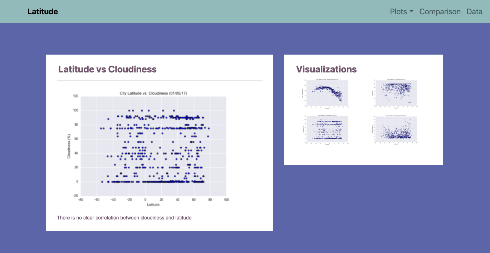
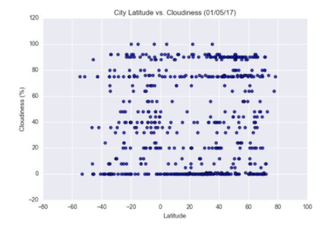

Objective is to create a model to predict forecast weather using machine learning techniques, using data from cities around the world and their main variables: cloudiness, humidity, temperature,wind.

